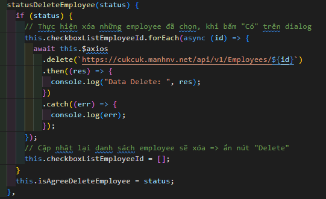

# Tài liệu quản lí employee

## 1.Xử lí nút Delete nhiều employee
- Khi bấm vào nút `Delete` thì thực hiện hiển thị Dialog xử lí trong (**handleDeleteEmployees()**)
- Khi nhấn vào nút "Có" hoặc "Không" trong dialog thì (**MISADialogQuestion.vue**):
    - Thực hiện lấy trạng thái khi bấm (`true || false`)
    - Thực hiện đóng dialog đó 
        -> Thực hiện bằng cách phát ra 1 tín hiệu đóng dialog
        
        `this.$msemitter.emit("closeDialogQuestion", status);`
    - Việc nhận sẽ được thực hiện trong `App.vue` (chỗ hiển thị các dialog)
    - Đồng thời nhận sự kiện `emitter` đó trong cả `EmployeeHome.vue` để lấy trạng thái khi bấm vào nút nào trên dialog đó
        - Việc lắng nghe trong hook `Created() { }`
        - Xử lí trong `methods` (**statusDeleteEmployee()**) thực hiện việc xóa các employee trong đây khi `status: true`
        <details>
        <summary>Minh họa</summary>
        
        
        </details>
        
## 2.Xử lí "TabIndex"
- Thực hiện xử lí trong `mounted` hook khi mà toàn bộ DOM đã được render
- Thực hiện tham chiếu đến tất cả các thẻ `INPUT || BUTTON` để có thể bắt các sự kiện trên đó
    <details>
    <summary>Minh họa</summary>
    
    ```js
        // =================== Handel Tab - Start =======================
        // Lấy toàn bộ những thẻ có thuộc tính "Ref"
        const tagsContainRefAttr = Object.values(this.$refs);
        const inputs = [];
        // Kiểm tra những thẻ khác có phải là thẻ INPUT hoặc BUTTON hay không
        tagsContainRefAttr.forEach((input) => {
          if (input.nodeName === "INPUT" || input.nodeName === "BUTTON") {
            inputs.push(input);
          }
        });
        // Thêm xử lý sự kiện khi nhấn phím Tab
        inputs.forEach((input, index) => {
          input.addEventListener("keydown", (event) => {
            if (
              event.key === "Tab" &&
              !event.shiftKey &&
              index === inputs.length - 1
            ) {
              // Nếu đang ở input cuối cùng và nhấn phím Tab, chuyển về input đầu tiên
              event.preventDefault();
              inputs[0].focus();
            }
          });
        });
        // Thêm xử lý sự kiện khi nhả phím Tab
        inputs.forEach((input, index) => {
          input.addEventListener("keyup", (event) => {
            if (event.key === "Tab" && event.shiftKey && index === 0) {
              // Nếu đang ở input đầu tiên và nhấn Shift + Tab, chuyển về input cuối cùng
              event.preventDefault();
              inputs[inputs.length - 1].focus();
            }
          });
        });
        // =================== Handel Tab - End =======================
    ```
    </details>
    
## 3. Thực hiện "Phân trang"
- Xử lí trong (`EmployeeHomeFooter.vue`, `EmployeeList.vue`)
- Xử lí phân trang thông quan Url bằng cách tăng giá trị `page`, `limit`
- Để dữ liệu có thể thay đổi liên tục khi `Url` thay đổi theo `page`, `limit` thì thực hiện theo dõi `$route.query` trong `watch() {}` hook trong `EmployeeList.vue` và xử lí sự thay đổi để lấy dữ liệu tương ứng qua function `fetchDataByPageAndLimit()`